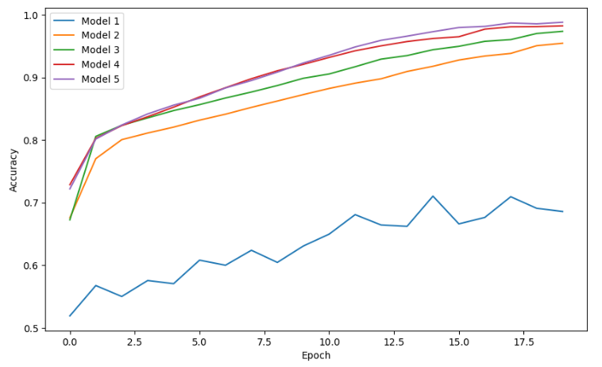
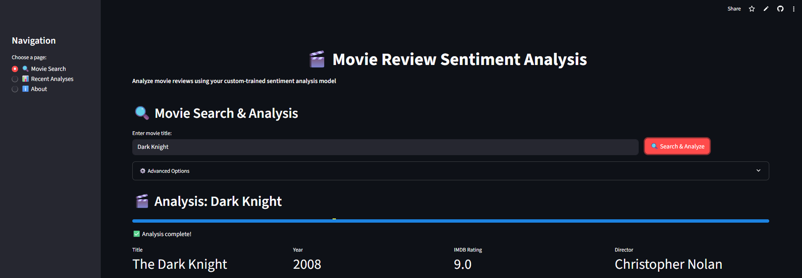
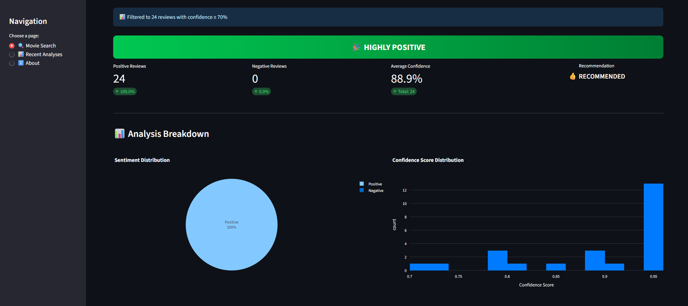
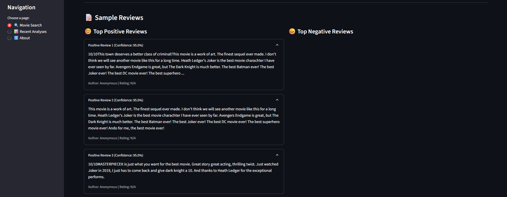

# 🎬 Movie Review Sentiment Analysis

A Python-based web app that:
- Scrapes **IMDb** for movie reviews
- Classifies each review as **positive** or **negative** using a trained sentiment model
- Presents interactive visualizations
- Generates a **verdict** for the movie (Recommended / Not Recommended / Depends)

Built using **Streamlit**, **Plotly**, and **BeautifulSoup**.

---
## 🧠 Model Training

To evaluate different RNN architectures for sentiment classification, multiple deep learning models were trained using TensorFlow/Keras. The core training setup tested the following layers:

- `SimpleRNN`
- `LSTM`
- `GRU`
- `Bidirectional(LSTM)`
- `Bidirectional(GRU)`

### 🔧 Architecture
Each model uses the following architecture:
- Input layer (with string input)
- Text vectorization
- Embedding layer
- One of the selected RNN layers
- Dense layer with ReLU
- Output layer with sigmoid activation

### 📊 Final Perfomance Score

| Model                         | Training Accuracy | Test Accuracy |
|------------------------------|-------------------|----------------|
| Model 1 - SimpleRNN          | 68.58%            | 63.89%         |
| Model 2 - LSTM               | 95.46%            | 76.27%         |
| Model 3 - GRU                | 97.36%            | 75.83%         |
| Model 4 - Bidirectional LSTM | **98.24%**        | **77.07%**     |
| Model 5 - Bidirectional GRU  | 98.81%            | 75.90%         |



✅ **Best Model:** Model 4 (Bidirectional LSTM) was selected for deployment due to its highest test accuracy of **77.07%**.

---
## 🚀 Features

- 🎬 Scrape IMDb reviews by simply entering a movie name  
- 🤖 Sentiment analysis using a custom-trained deep learning model  
- 📈 Dynamic dashboard with:  
  - 📊 Positive vs Negative review counters  
  - 📉 Average model confidence score  
  - 👍 Movie recommendation verdict  
- 🥧 Sentiment distribution pie chart  
- 📊 Confidence score histogram   
- 🎯 Fast, accurate, and interactive user experience powered by Streamlit 
- 🖥️ Responsive and clean Streamlit interface

---
## 🖼️ Application Screenshots




## 🎯 Application Link  
🔗 [Click here to open the Movie Review Sentiment Analysis Web App](https://movie-review-sentiment-analysis-8nx9czmvtsc2xiwgz64pzr.streamlit.app/)

---

## ⚙️ How to Run This Project Locally

Follow the steps below to clone, set up, and run this project on your local machine:

### ✅ Prerequisites

Ensure the following are installed:

- Python 3.8 or higher
- Git
- pip (Python package manager)
- virtualenv (optional but recommended)

---

### 📥 1. Clone the Repository

```bash
git clone https://github.com/jee-371/movie-review-sentiment-analysis.git
cd movie-review-sentiment-analysis
```

---

### 📦 2. Install Dependencies

If you’re using a virtual environment:

```bash
python -m venv venv
source venv/bin/activate      # On Windows: venv\Scripts\activate
```

Now install required packages:

```bash
pip install -r requirements.txt
```

---

### 🚀 3. Run the Streamlit App

```bash
streamlit run app.py
```

This will open the app in your browser at `http://localhost:8501`.

---

## 📄 Project Structure

```bash
.movie-review-sentiment-analysis/
├── images/
│   ├── model-perfomance.png
│   ├── mrsa1.png
│   ├── mrsa2.png
│   └── mrsa3.png
│
├── model/
│   └── best_model.h5
│
├── scripts/
│   ├── app/
│   │   ├── app.py
│   │   └── scraper_integrated.py
│   └── training/
│       └── sentiment-analysis-training.ipynb
│
├── README.md
├── requirements.txt
```
